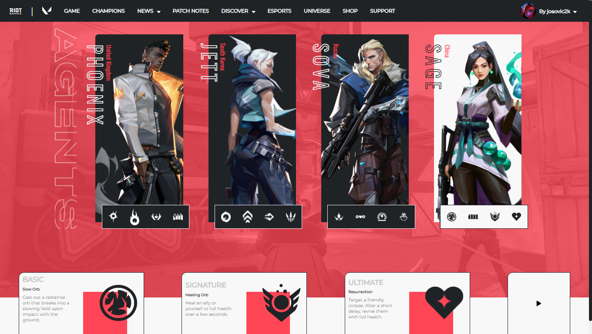
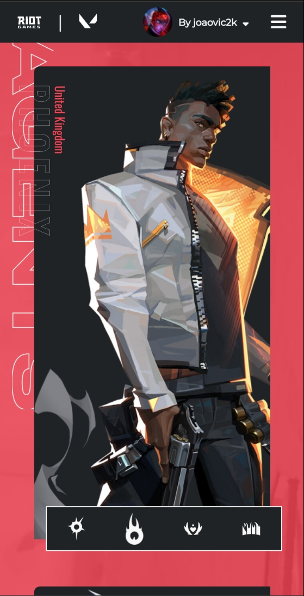

# Valorant
Valorant - design de conceito da página de agentes
No seu terminal dentro do diretório:
```bash
git clone "https://github.com/joaovic-tech/Valorant.git"
```
<hr>
<div align="center">
  <h1>🌙Interfaces🔆</h1>
  <hr>

| Desktop                                     | Mobile                                            |
|:-------------------------------------------------:|:-----------------------------------------------:|
|   |          |

</div>
<hr>
<div align="center"><br>
  <h1>Tecnologias utulizadas:</h1>
  
   &nbsp;
   &nbsp;
   &nbsp;
   &nbsp;
   &nbsp;
   &nbsp;
   &nbsp;
  
</div>
